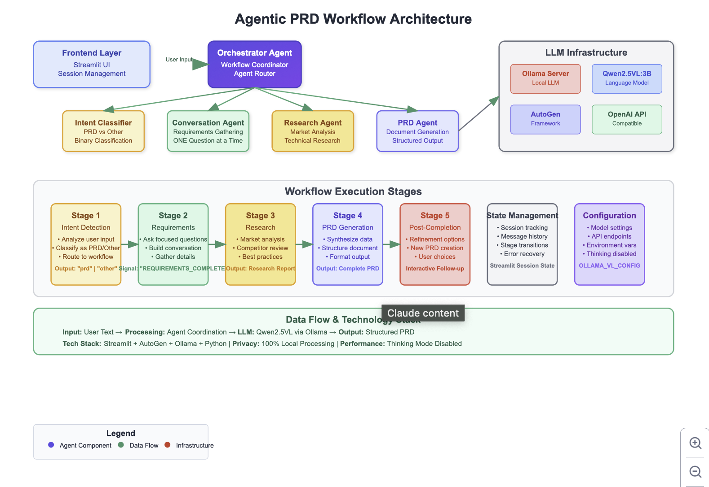

# AutoGen PRD Generator

Generate comprehensive Product Requirements Documents through AI conversation. Uses multi-agent orchestration with local LLMs.



## Quick Start

```bash
# Clone and install
git clone https://github.com/yourusername/autogen-prd-generator
cd autogen-prd-generator
pip install -r requirements.txt

# Start local LLM (example with Ollama)
ollama serve
ollama pull qwen2.5vl:3b

# Run
streamlit run ui.py
```

## How It Works

5 AI agents work together:
- **Orchestrator**: Manages workflow
- **Intent Classifier**: Understands requests  
- **Conversation Agent**: Asks focused questions
- **Research Agent**: Analyzes market/competition
- **PRD Agent**: Generates final document

## Features

- **Conversational interface** - Natural Q&A instead of forms
- **Local processing** - No external APIs required
- **Model agnostic** - Works with any OpenAI-compatible endpoint
- **Professional output** - Structured PRDs with research

## Configuration

Edit `config.py` for your model:

```python
OLLAMA_VL_CONFIG = {
    "config_list": [{
        "model": "your-model-name",
        "base_url": "http://localhost:11434/v1",
        "api_key": "not-required",
    }]
}
```

Supports:
- **Ollama** (local): Any model with chat completion
- **OpenAI API**: GPT-3.5/4 
- **Other providers**: Anthropic, Cohere, etc.

## Example Flow

```
User: "Build a task management app"
AI: "Who are your target users?"
User: "Remote teams of 5-20 people"
AI: "What's the main workflow problem you're solving?"
[4-5 more focused questions]
AI: "Generating comprehensive PRD..."
```

Output: Professional PRD with market research, technical specs, and implementation plan.

## Generated PRD Sections

1. Executive Summary
2. Product Overview  
3. Target Users & Personas
4. Functional Requirements
5. Technical Requirements
6. Success Metrics
7. Timeline & Milestones
8. Risk Assessment
9. Market Research
10. Implementation Plan

## Project Structure

```
├── agents.py      # Agent definitions
├── config.py      # Model configuration  
├── ui.py          # Streamlit interface
├── workflow.py    # Backend logic
├── tools.py       # Utilities
└── main.py        # CLI version
```

## Customization

**Different models:**
```python
# In config.py
"model": "gpt-4"                    # OpenAI
"model": "claude-3-sonnet"          # Anthropic  
"model": "llama3:8b"                # Ollama
```

**Custom agents:**
```python
# In agents.py
def create_custom_agent():
    return autogen.AssistantAgent(
        name="specialist",
        system_message="Your custom instructions..."
    )
```

## Requirements

- Python 3.11+
- 4GB+ RAM (for local models)
- LLM provider (Ollama, OpenAI, etc.)

## License

MIT
